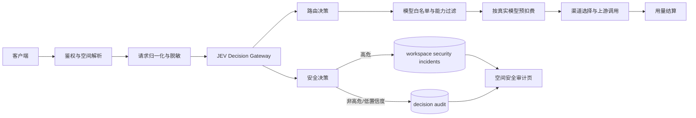

# JEV 驱动的自动路由与安全审计

> 状态：架构设计（第一版）  
> 目标：把当前基于关键词的 `capi-auto` 路由升级为 JEV 决策层，并让高危信息泄露检测共享同一套 JEV 能力、置信度门槛和空间审计记录。

## 1. 设计结论

JEV 不作为普通聊天模型使用，而作为一个低延迟、强类型的决策服务：

- 自动路由：判断请求意图、风险和复杂度，返回候选路由与置信度。
- 安全审计：判断输入/输出是否包含高危信息泄露，返回泄露类型、严重级别和置信度。
- 低置信度：不猜测、不自动升级权限，回退到保守规则或人工复核。
- 高危命中：立即写入当前空间的安全事件，保存脱敏证据，允许空间成员翻阅。

JEV 的上游协议继续使用已有的 `POST /api/v1/evaluate`，不把 `typesafe-ai/jev` 发送到 `/chat/completions`。

## 2. JEV 能力边界

JEV 的输入是 `state` 与一组 typed `questions`，输出是 typed answer 和 confidence。第一版只使用三种原语：

| 用途 | 原语 | 结果 |
| --- | --- | --- |
| 路由意图 | `choice` | `chat`、`code`、`analysis`、`sensitive`、`media`、`other` |
| 风险分数 | `score` | 0 到 1 的风险/复杂度分数 |
| 泄露判断 | `noul` | 是否命中某类泄露，以及概率 |

JEV 只负责“判断”。真实模型白名单、空间权限、渠道可用性、预算和重试仍由 Capi 自己校验。JEV 不拥有调用模型、扣费、修改权限或删除证据的能力。

参考：

- [System One](https://docs.typesafe.ai/concepts/system-one)
- [Confidence-gated routing](https://docs.typesafe.ai/patterns/confidence-routing)

## 3. 总体架构



### 请求时序

1. 先鉴权，确定 `userId / workspaceId / apiKey / permissions`。
2. 判断请求是显式模型还是自动别名（包括用户自定义的自动路由别名）。
3. 生成一份经过大小限制和脱敏的 JEV `state`；原始请求不直接写入 JEV 日志。
4. JEV 一次返回路由问题和安全问题的 typed answers。
5. 置信度达到门槛时采用 JEV 结论；否则使用保守规则：标准模型、禁止敏感升级、安全结果标记为 `review`。
6. 过滤 API key 可用模型、空间允许的渠道和当前能力，再选择真实模型。
7. 以真实模型和真实渠道价格预扣费，调用上游并结算。
8. 高危安全结论在请求结束前幂等写入空间事件；失败只影响审计告警，不改变已经完成的模型调用结果。

关键顺序是：`鉴权 → JEV 判断 → 真实模型解析 → 权限/能力过滤 → 渠道选择 → 预扣费 → 调用`。`capi-auto` 只是一种入口别名，不参与倍率计算。

## 4. JEV Decision Gateway

新增一个服务端模块 `lib/jev/gateway.ts`，对 relay 隐藏 JEV 上游协议细节：

```ts
type JevDecision = {
  route: {
    intent: "chat" | "code" | "analysis" | "sensitive" | "media" | "other";
    complexity: "light" | "standard" | "advanced";
    confidence: number;
  };
  security: {
    categories: Array<"credential" | "personal_data" | "internal_data" | "prompt_injection" | "none">;
    severity: "none" | "low" | "high" | "critical";
    confidence: number;
  };
  provider: { requestId: string; model: string; durationMs: number };
};
```

Gateway 只接受结构化结果，并统一做以下校验：

- answer 类型、枚举值、概率范围和 `state` 版本校验；
- 超时、上游错误、非法 JSON 都转成 `unavailable`，绝不把异常答案当成允许；
- JEV 请求只发送必要上下文，删除 API key、Authorization、cookie、完整 URL 参数和大段二进制；
- 记录 `jevRequestId` 与 schema 版本，方便回放和审计，但不保存上游凭证。

### 置信度策略

| 决策 | 默认门槛 | 未达到门槛时 |
| --- | ---: | --- |
| 普通模型复杂度 | 0.60 | `standard` |
| 敏感请求识别 | 0.80 | 不做敏感升级，标记 `review` |
| 高危泄露告警 | 0.85 | 不自动升级为高危，但保留低置信度审计记录 |
| `critical` 处置 | 0.92 | 进入人工复核，不自动阻断业务 |

门槛是服务端策略，不由客户端请求覆盖。后续可以按空间配置，但必须限制在平台允许的范围内。

## 5. 自动路由改造

当前 `classifier.ts -> resolve.ts` 的关键词分类改为：

```text
resolveAutoRoute()
  ├─ 读取 workspace autoRoute 配置
  ├─ callJevDecision({ route questions, security questions })
  ├─ confidence gate
  ├─ intent/complexity -> route profile -> candidate model
  ├─ assertModelAllowed(apiKey, candidate)
  └─ registry.candidateIds(group, candidate)
```

路由配置不再保存三个固定模型，而保存“路由 profile”：

```json
{
  "alias": "capi-auto",
  "profiles": {
    "chat": { "light": "gpt-4o-mini", "standard": "gpt-4o", "advanced": "gpt-5.5" },
    "code": { "light": "gpt-4o-mini", "standard": "gpt-5.5", "advanced": "gpt-5.5" },
    "sensitive": { "standard": "gpt-5.5" }
  },
  "fallback": { "intent": "other", "complexity": "standard" }
}
```

必须保留现有的自定义别名语义：保存的名称既是展示名称，也是请求入口；`/api/v1/models` 应展示该别名，解析时再映射到 JEV 决策和真实模型。

## 6. 安全审计与空间阅览

### 事件分级

- `none`：不落敏感内容，只记录决策元数据。
- `low`：记录摘要和类别，不触发通知。
- `high`：记录脱敏证据，进入空间安全审计列表。
- `critical`：记录脱敏证据、请求/响应方向、置信度和处置状态，可触发空间管理员通知；第一版不自动阻断请求。

### 数据模型（上线前直接加入 SQLite 初始化定义）

```sql
CREATE TABLE security_incidents (
  id INTEGER PRIMARY KEY AUTOINCREMENT,
  workspace_id INTEGER NOT NULL REFERENCES workspaces(id) ON DELETE CASCADE,
  request_id TEXT NOT NULL,
  key_id INTEGER REFERENCES api_keys(id) ON DELETE SET NULL,
  direction TEXT NOT NULL CHECK (direction IN ('input', 'output', 'both')),
  severity TEXT NOT NULL CHECK (severity IN ('low', 'high', 'critical')),
  categories TEXT NOT NULL CHECK (json_valid(categories)),
  confidence REAL NOT NULL CHECK (confidence >= 0 AND confidence <= 1),
  evidence TEXT NOT NULL CHECK (json_valid(evidence)),
  status TEXT NOT NULL DEFAULT 'open' CHECK (status IN ('open', 'reviewing', 'resolved', 'false_positive')),
  created_at INTEGER NOT NULL,
  resolved_at INTEGER,
  resolved_by INTEGER REFERENCES users(id),
  UNIQUE(workspace_id, request_id, direction)
) STRICT;
CREATE INDEX security_incidents_workspace_time ON security_incidents(workspace_id, created_at);
CREATE INDEX security_incidents_workspace_status ON security_incidents(workspace_id, status, severity);
```

`evidence` 只允许脱敏后的短片段、字段路径、哈希和规则版本，例如：

```json
{
  "snippets": ["sk-••••••••9f2a"],
  "paths": ["messages[2].content"],
  "fingerprints": ["sha256:..."],
  "redactionVersion": "v1"
}
```

绝不保存完整 API key、cookie、Authorization、密码或完整原始对话。空间成员只能看到自己有权限的空间事件；普通成员默认只读，管理员可以更新 `status` 和处置备注。

### 页面与 API

- `GET /api/workspaces/:wid/security/incidents`：分页、按严重级别/状态过滤。
- `PATCH /api/workspaces/:wid/security/incidents/:id`：管理员标记复核、已解决或误报。
- `dashboard/w/:workspaceId/security`：空间安全页，顶部显示未处理高危数，下面是事件列表和脱敏详情。
- 将“安全审计”加入空间导航，与用量日志并列；不放到平台管理员页，避免跨空间泄露。

## 7. 故障与安全边界

1. JEV 不可用：自动路由回退 `standard`，安全审计写入 `jev_unavailable` 的决策日志；不能据此判定“安全”。
2. JEV 低置信度：不自动升级模型、不自动判定高危；保留 `review` 事件供空间翻阅。
3. 审计写入失败：记录服务端错误和请求 ID，不能把完整敏感内容打进应用日志。
4. 重试：同一个 `requestId + direction` 幂等，避免重复告警。
5. 输出审计：流式响应在完成/取消时做一次聚合判断；不把每个 token 单独送 JEV。
6. 权限：JEV 上游 key 只存在服务端渠道配置，空间 API key 永不发送给 JEV。

## 8. 迭代顺序

1. 抽出 `lib/jev/gateway.ts`，复用已有 evaluate relay 和 TypeSafe 映射。
2. 将 `resolveModel` 改成 JEV 路由 + 置信度门控，保留规则回退和真实模型计费顺序。
3. 加入 `security_incidents` 表、脱敏器和幂等写入服务。
4. 在 chat/responses/evaluate 入口接入输入审计；chat 响应完成后接入输出审计。
5. 加入空间安全 API、页面和导航，再用真实登录态验收空间隔离、翻阅和处置。
6. 用 JEV unavailable、低置信度、高危命中、重复请求和流式取消补齐测试。

这份设计刻意把 JEV 限制在“结构化判断层”，把权限、计费、渠道和证据保留在 Capi 内部，保证自动路由升级不会改变现有的安全边界。
